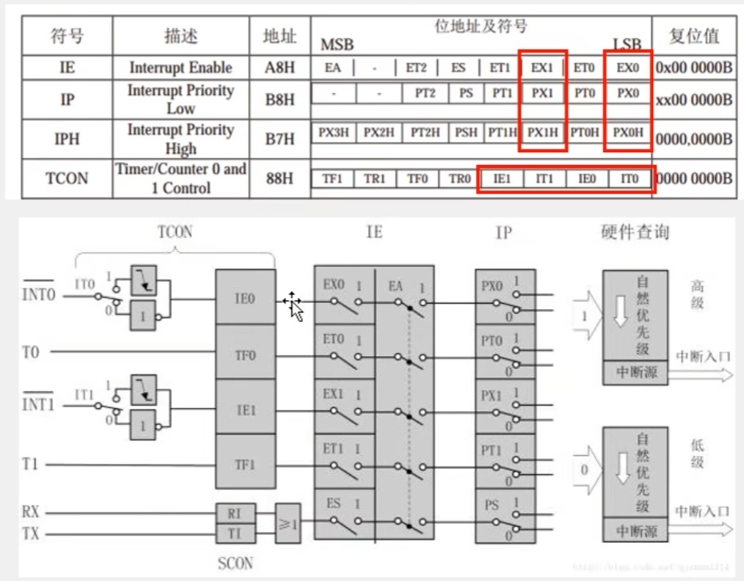
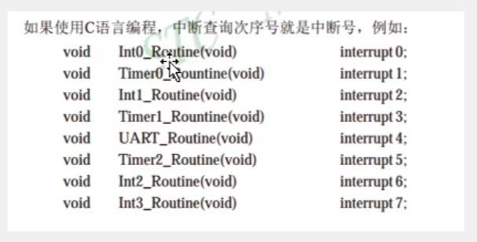
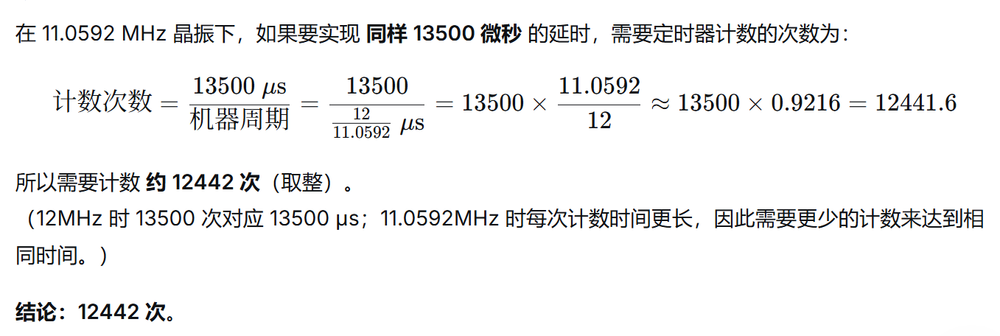

寄存器：

中断号：

## 1、状态机测试
状态机测试的时候出错有可能是定时器零寄存器配置的源定时器初始值要把它配成零以及中断要把它配置为下降液以及要把IR_time设置成int

## 2、掩码
IR_Data[IR_pData / 8] &= ~(0x01 << (IR_pData % 8));
IR_pData 是当前接收到的 位序号（0 ~ 31）。

IR_pData / 8 → 计算这个位属于第几个字节（0 ~ 3）。

IR_pData % 8 → 计算这个位在该字节中的位置（0 ~ 7）。

0x01 << (IR_pData % 8) → 生成一个只有对应位为1的掩码（例如：第3位 → 0b00001000）。

~(掩码) → 将该位取反，变成 11110111。

IR_Data[字节] &= 取反后的掩码 → 将原字节中的 那一位清零，其他位保持不变。

## 3、计数器计数次数

